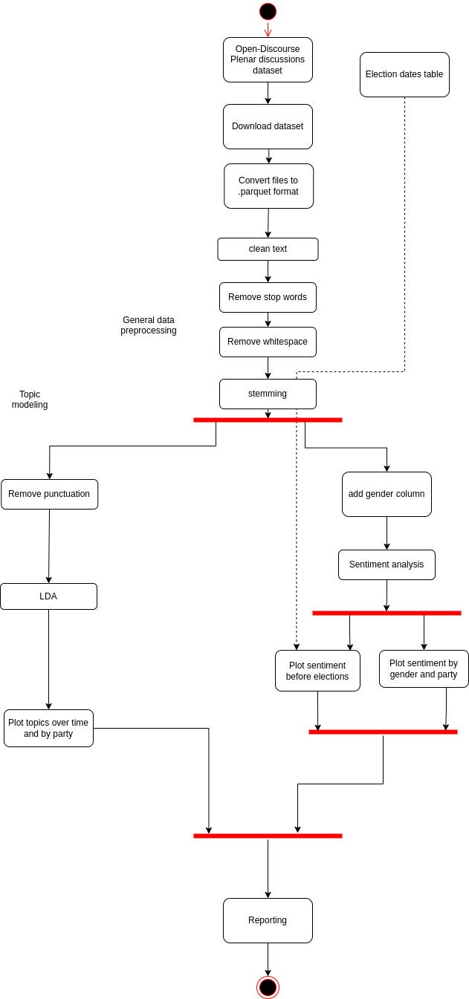

# functional requirements

The following activity diagram illustrates the process of our snakemake workflow.  

  
# non-functional requirements

This project aims to develop a workflow system that is both efficient and user-friendly, 
with a focus on aspects like:

- **Interoperability**: The workflow should run on all major operating systems in a python 3 environment.
- **Extensibility**: The workflow will be built in a modular way, so that the implementation of new functionalities or module blocks is possible without a huge integration effort.
- **Scalability**: The workflow should efficiently scale to handle increasing data volumes and more complex pipelines, supporting both single-machine and distributed execution environments.
- **Responsetime**: The workflow should have a quick response time, with individual tasks starting execution within a few seconds of being triggered.
- **Usability**: The workflow should be easy to configure, with clear and comprehensive documentation. Users should be able to understand and use the workflow with minimal effort.
- **Maintainability**: The workflow should be easy to maintain, with clear code organization and documentation. It should support automated testing to ensure the integrity of new changes.

# component analysis

The following table contains all components of our snakemake workflow. It contains the name of the node operation,
the input, output and library/implementation idea.

| Abstract Workflow Node (Operation)        | Input(s)                  | Output(s)                   | Implementation                                                                  |
|-------------------------------------------|---------------------------|-----------------------------|---------------------------------------------------------------------------------|
| Open-Discourse Plenar discussions dataset | none                      | zip file                    | https://dataverse.harvard.edu/dataset.xhtml?persistentId=doi:10.7910/DVN/FIKIBO |
| Download dataset                          | none                      | zip file                    | wget                                                                            |
| Convert files to .parquet format          | .csv or .tab file         | .parquet file               | polars                                                                          |
| clean speeches                            | list of speeches          | list of speeches            | polars, regex library                                                           |
| remove stopwords                          | string                    | string                      | polars, spaCy & NLTK                                                            |
| remove whitespaces                        | string                    | string                      | string library                                                                  |
| stemming                                  | string                    | string                      | polars, spaCy & NLTK                                                            |
| remove punctuation                        | speech text               | speech text w/o punctuation | polars, string library                                                          |
| LDA                                       | tokenized text            | list of topics              | sci-kit learn                                                                   |
| Plot topics over time and by party        | topics list               | Dendrogram                  | sciPy/plotly                                                                    | 
| add gender column                         | dataset                   | dataset                     | own implementation                                                              |
| Sentiment analysis                        | speech text               | sequence sentiment values   | NLTK GerVADER, Pytorch                                                          |
| Plot sentiment before elections           | sequence sentiment values | some kind of plot           | seaborn/matplotlib                                                              |
| Plot sentiment by gender and party        | sequence sentiment values | some kind of plot           | seaborn/matplotlib                                                              |
| Reporting                                 | Plots                     | Report                      | own implementation                                                              |
